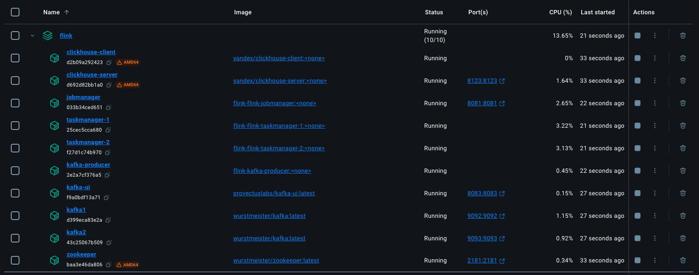
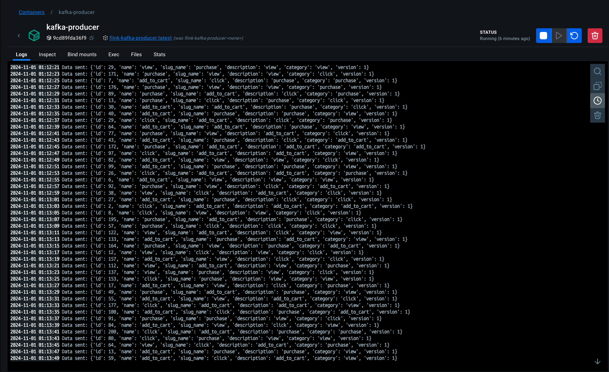
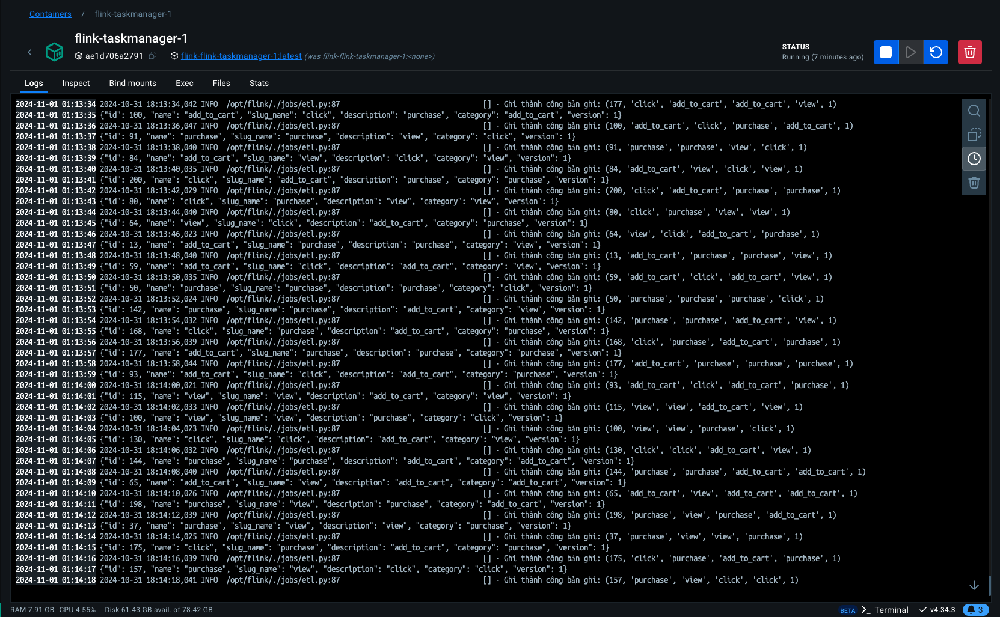
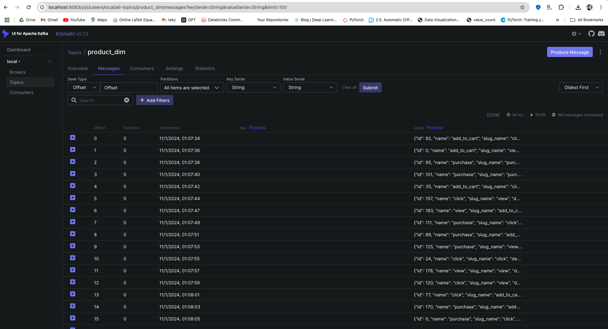
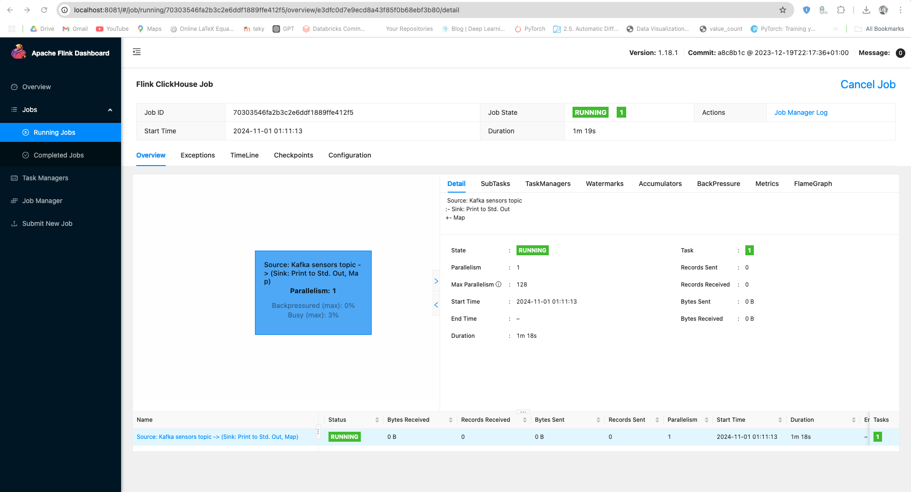
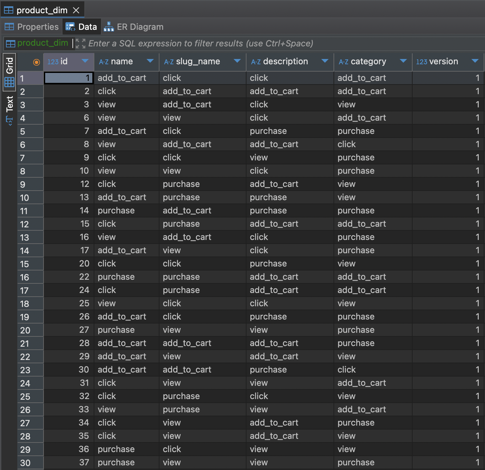

# Realtime data kafka-flink-clickhouse [python]

I implemented a real-time processing solution for the system support to provide quick analysis by using **kafka** to send data by message queue and **flink** will be the central processor to transform the data to **clickhouse**.

Everything is done in python 3.10 and macOS platform.

1. Launch the multi-container application

```bash
➜  flink git:(main) ✗ docker compose up -d --build
```

Launch the containers by running docker-compose.

`-d`: to do it with detached mode.

`--build`: to rebuild Dockerfiles if there are changes.

2. Initializing the Flink task
   Currently I cannot run the task right during the container build process, so please try to run it using an external command.

```bash
docker compose exec flink-jobmanager flink run -py ./jobs/etl.py -d
```

Expected output:

```bash
➜  flink git:(main) ✗ docker compose exec flink-jobmanager flink run -py ./jobs/etl.py -d
✅ Initializing environment
🐿️ Configuring source and sinks
🙊 Create a DataStream from the Kafka source and assign watermarks
🚀 Ready to sink data
Job has been submitted with JobID 70303546fa2b3c2e6ddf1889ffe412f5
```

> I am building airflow services to run tasks using the interface. You don't need to care about these related services yet. If you have any good solutions, please let me know!

### Example

- Containers (full service running)
  
- kafka-producer: Imitate products send to message queue
  
- flink-taskmanager: Data that flink receives from kafka
  
- kafka-ui: Kafka management interface at `<a href='http://localhost:8083/'>`localhost:8083 `</a>` and topic `product_dim`
  
- flink-jobmanager: Flink management interface at `<a href='http://localhost:8081/'>`localhost:8081 `</a>`
  
- I use database management is `<a href="https://dbeaver.io/">`BDever `</a>` and information connect:

<ol>
    <li>host: localhost</li>
    <li>port: 8123</li>
    <li>user: default</li>
    <li>database: olap</li>
</ol>

or you can also use the replace command:

```bash
➜  flink git:(main) ✗ docker exec -it clickhouse-server clickhouse-client --query "SELECT COUNT(*) FROM olap.product_dim;" 
```



*Note*: `.env` create from `.env_example` include enviroment to build airflow (not care)

```.env
AIRFLOW_UID=<id -u>
AIRFLOW_GID=<id -g>
```

replace `<id -u>` by id user local machine as:

```bash
➜  flink git:(main) ✗ id -u                                                         
501
```

similar to group.

### Discuss

I tried to learn about using sink `jdbc` to clickhouse but I can't implement it in python so I use `clickhouse-connect` instead. If you can implement it in python please let me know, Thanks!

✉️ quachnam311@gmail.com
